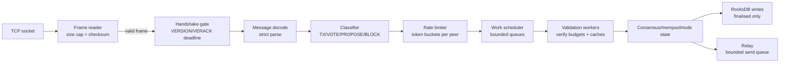
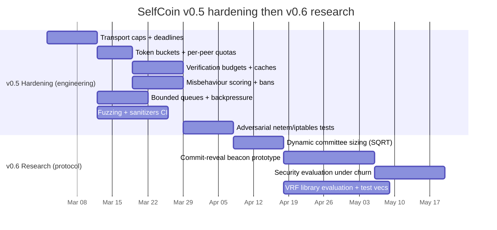

# SelfCoin v0.x Hardening and Protocol Research Report

## Executive summary

SelfCoin v0.4 has reached a point where the dominant risk on a public testnet is no longer “consensus correctness” but **operational survivability under hostile traffic**: slow reads, oversized frames, invalid-yet-expensive messages, signature verification floods, and state-explosion attacks that exhaust memory/CPU/storage. Hardening for v0.5 should therefore be organised around a single design principle: **reject earlier, bound everything, and account for work**. This is consistent with real-world lessons from other permissionless P2P networks that use peer scoring and bans but can themselves be vulnerable if scoring is naïvely implemented. citeturn0search6turn0search2turn0search22

The recommended v0.5 hardening package has four pillars:

- **Transport safety**: strict frame size enforcement before allocation, read/write deadlines, handshake deadlines, bounded per-peer send queues, and connection-rate limiting (anti‑slowloris and anti‑memory blow‑ups). TCP keep-alive is useful for cleaning up long-dead connections but should remain configurable and conservative, as the TCP host requirements treat keep-alives carefully. citeturn5search2turn5search6turn5search0  
- **Application-layer fairness**: per-peer token buckets and quotas (TX/PROPOSE/VOTE/BLOCK) approximate the widely deployed “token bucket” model used to police burstiness and sustained rates. citeturn0search0turn5search3turn0search20  
- **Work accounting**: verification budgets for expensive cryptography (Ed25519 and script checks), caching of verified items, and bounded validation queues so CPU cannot be driven into starvation by a few peers. libsodium’s signature APIs make verification outcomes explicit and fast, but you still must bound how often you call them per peer. citeturn3search0turn3search3  
- **Misbehaviour scoring and bans**: track per-peer offences, decay scores over time, ban by IP (with care for NAT), and make bans observable. Research on Bitcoin’s ban/misbehaviour mechanisms shows both usefulness and pitfalls such as “slander” and “BitMsg-DoS” vectors when scoring is not designed conservatively. citeturn0search6turn0search2turn0search22  

For protocol research (v0.6+), committee-based finality already brings SelfCoin closer to modern scalable BFT families. The next step is (i) **dynamic committee sizing** to maintain security while reducing overhead and (ii) improving the **randomness beacon** used to pick committees/leaders. Your current deterministic seed-from-finalised-hash approach is straightforward but can have biasability concerns depending on who can influence the seed. Commit‑reveal beacons improve decentralised unpredictability but introduce classical “last‑revealer”/withholding issues that have been studied in RANDAO-style designs. VRFs (standardised by the IETF) provide public verifiability and strong unpredictability but significantly raise cryptographic and implementation complexity unless you use a mature library. citeturn1search0turn2search0turn2search8turn4search0

The recommended sequence is:

1) v0.5 hardening and adversarial testing harnesses (including fuzzing), then  
2) v0.6 dynamic committee sizing, then  
3) v0.6.1 commit‑reveal prototype (research network), then  
4) VRF selection as a longer-term track.

## Threat model for a permissionless BFT-style chain

A permissionless BFT-style blockchain exposed to the open Internet must assume adversaries who can cheaply create connections, send malformed inputs, and selectively craft messages that are **cheap to generate but expensive to validate** (computational asymmetry). PBFT and HotStuff show that BFT safety relies on quorum assumptions (e.g., \(n \ge 3f+1\)) but the *availability* of implementations depends heavily on network and resource controls that are outside the pure consensus proof. citeturn1search6turn1search3

The table below enumerates practical threats mapped to SelfCoin modules.

| Dimension | Attack pattern (examples) | Primary cost to defender | Where it hits SelfCoin | Core defensive idea |
|---|---|---|---|---|
| Network / transport | Slowloris-style partial frames; handshake stalls; connection churn; oversized payload lengths | socket + buffer memory; thread/event-loop starvation | `p2p/framing`, `peer_manager` | deadlines, size caps before allocation, connection-rate limits |
| CPU | Vote storms forcing Ed25519 verify; TX storms forcing script verify; repeated invalid blocks causing deep validation | signature verification, script evaluation, hashing | `consensus/votes`, `utxo/validate`, `mempool` | per-peer verification budgets, caching “already verified”, early reject |
| Memory | Unbounded vote/proposal caches; unbounded tx maps; per-peer outbound queues growing without backpressure | heap growth, allocator pressure, OOM kill | `node` message handlers, `votes` caches, relay layer | bounded maps/queues, per-peer caps, drop policies |
| Storage | Disk fill via spamming blocks/tx indices; RocksDB write amplification under adversarial keys | disk space, compaction CPU, I/O latency | `storage/db`, indexing pipeline | only index finalised data, column-family/QoS, size-based retention |
| Application-layer | Valid-but-useless messages: wrong height/round; non-committee votes; repeated stale tips; duplicate TX relays | CPU + bandwidth; log spam | consensus message handlers | strict “current window” acceptance, dedupe, score penalties |
| Adversarial networking | Latency/loss injection; partial partitions; asymmetric connectivity | liveness stalls; extra rounds | timeout/round logic | timeouts, multi-peer fanout, seeds diversity, observability |

Three observations drive engineering choices:

- **Deadlines and caps are correctness-adjacent** in BFT systems: if one peer can prevent the node event-loop from serving other peers, liveness collapses even if consensus rules are perfect.  
- **Asymmetry is the main enemy**: always ensure the attacker pays at least roughly proportional cost for what they force you to do (token buckets, verification budgets, PoW puzzles if you ever add them). Token bucket policing is a common engineering tool for this exact goal. citeturn0search0turn5search3  
- **Misbehaviour scoring is necessary but not sufficient**: literature on Bitcoin’s misbehaviour/ban scoring shows it can be exploited if scoring rules are simplistic or rely on third-party claims (“slander”). Your scoring must be based on locally verifiable facts, decayed over time, and carefully rate-limited. citeturn0search2turn0search6turn0search22  

## Engineering hardening for v0.5

The v0.5 aim is not “perfect DDoS protection” but **bounded resource usage per peer and per subsystem**, such that a node remains responsive under hostile traffic and continues to finalise blocks when enough honest peers exist.

### Concrete mitigations and recommended defaults

The defaults below are meant for an Internet testnet and should remain configurable per network profile. They are intentionally conservative.

| Control | Default | Rationale |
|---|---:|---|
| `MAX_PAYLOAD_LEN` | 8 MiB (already) | enforce before allocation to prevent memory bombs |
| `HANDSHAKE_TIMEOUT_MS` | 10,000 ms | enough for WAN jitter; prevents handshake stalls |
| `FRAME_READ_TIMEOUT_MS` | 3,000 ms | prevents slow frame drip; tune for mobile networks |
| `IDLE_TIMEOUT_S` | 120 s | clears dead peers; keep-alive optional |
| `MAX_INBOUND` / `MAX_OUTBOUND` | 64 / 16 | contains FD usage |
| Per-peer send queue | 4 MiB or 1,000 msgs | prevents backpressure memory leaks |
| Conn rate limit per /24 | 10 new conns / 10 s | slows churn attacks (NAT-aware) |
| Token bucket (TX) | 20 tx/s burst 200 | TX floods are common; adjust to mempool caps |
| Token bucket (VOTE) | 50 votes/s burst 500 | votes are small but can be CPU-expensive |
| Token bucket (PROPOSE/BLOCK) | 2/s burst 10 | large messages; discourage spam |
| Verify budget (Ed25519) | 200 verifies/s per peer | keep CPU predictable; caches reduce repeats |
| Verify budget (script) | 50 script verifies/s per peer | scripts are heavier; depends on tx size |
| Mempool max | 50,000 tx or 128 MiB | bound memory and validation load |
| Min relay fee (testnet) | 1 sat/byte equivalent or fixed min fee | discourages free spam; configurable |
| Ban threshold | 100 score; ban 10 minutes (testnet) | shorter than Bitcoin’s historic 24h to reduce collateral damage while testing citeturn0search6turn0search22 |

Token buckets are a proven pattern in networking: they bound sustained rates while allowing limited bursts, and are used in traffic conditioning architectures and marker specifications. citeturn5search3turn0search0turn0search20

### Implementation details for C++20

A robust hardening implementation is easiest if you treat message handling as a **pipeline** with explicit accounting at each stage.

#### Pipeline architecture



The key is to ensure every arrow is either bounded or drops work deterministically.

#### Core C++ API sketches

**Token bucket** (per peer, per message type). The algorithmic idea is described in token-bucket policing approaches used widely in DiffServ contexts and related RFCs. citeturn5search3turn0search0

```cpp
// src/p2p/ratelimit.hpp
#pragma once
#include <chrono>
#include <cstdint>

namespace selfcoin {

struct TokenBucket {
    double capacity;        // tokens
    double tokens;          // current tokens
    double refill_per_sec;  // tokens/second
    std::chrono::steady_clock::time_point last;

    bool consume(double cost, std::chrono::steady_clock::time_point now) {
        refill(now);
        if (tokens >= cost) { tokens -= cost; return true; }
        return false;
    }

    void refill(std::chrono::steady_clock::time_point now) {
        using sec = std::chrono::duration<double>;
        double dt = std::chrono::duration_cast<sec>(now - last).count();
        if (dt > 0) {
            tokens = std::min(capacity, tokens + dt * refill_per_sec);
            last = now;
        }
    }
};

enum class MsgClass : uint8_t { TX, VOTE, PROPOSE, BLOCK, OTHER };

struct PeerRateLimiter {
    TokenBucket tx, vote, propose, block;

    bool allow(MsgClass c, std::size_t bytes,
               std::chrono::steady_clock::time_point now) {
        const double base = 1.0;
        const double byte_cost = 0.0001 * static_cast<double>(bytes); // tune
        const double cost = base + byte_cost;

        switch (c) {
            case MsgClass::TX:      return tx.consume(cost, now);
            case MsgClass::VOTE:    return vote.consume(cost, now);
            case MsgClass::PROPOSE: return propose.consume(cost, now);
            case MsgClass::BLOCK:   return block.consume(cost, now);
            default: return true;
        }
    }
};

} // namespace selfcoin
```

**Misbehaviour scoring**: inspired by real-world “ban score” mechanisms, but designed to avoid easy slander or amplification. Research shows such mechanisms are useful yet can be attacked if not carefully constrained. citeturn0search6turn0search2turn0search22

```cpp
// src/p2p/score.hpp
#pragma once
#include <chrono>
#include <cstdint>
#include <string>

namespace selfcoin {

enum class Offence : uint8_t {
    BadChecksum,
    OversizeFrame,
    PreHandshakeConsensusMsg,
    BadPayloadParse,
    InvalidVoteSig,
    InvalidPropose,
    InvalidTx,
    DuplicateSpam,
    ExcessRate,
};

struct PeerScore {
    int32_t score = 0;
    std::chrono::steady_clock::time_point last_decay;

    void add(Offence o) {
        score += weight(o);
        score = std::min(score, 100000); // hard cap
    }

    void decay(std::chrono::steady_clock::time_point now) {
        using sec = std::chrono::duration<double>;
        double dt = std::chrono::duration_cast<sec>(now - last_decay).count();
        if (dt <= 0) return;
        // Example: linear decay 1 point per 10 seconds
        int32_t dec = static_cast<int32_t>(dt / 10.0);
        if (dec > 0) {
            score = std::max<int32_t>(0, score - dec);
            last_decay = now;
        }
    }

    static int32_t weight(Offence o) {
        switch (o) {
            case Offence::BadChecksum: return 5;
            case Offence::OversizeFrame: return 20;
            case Offence::PreHandshakeConsensusMsg: return 10;
            case Offence::BadPayloadParse: return 5;
            case Offence::InvalidVoteSig: return 10;
            case Offence::InvalidPropose: return 20;
            case Offence::InvalidTx: return 10;
            case Offence::DuplicateSpam: return 2;
            case Offence::ExcessRate: return 1;
        }
        return 1;
    }
};

} // namespace selfcoin
```

**Verification budgets and caches**: signature verification is explicitly defined in libsodium docs; it returns success/failure, but you must decide when to call it. citeturn3search0

```cpp
// src/node/verify_budget.hpp
#pragma once
#include <chrono>
#include <cstdint>
#include <unordered_map>

namespace selfcoin {

struct VerifyBudget {
    TokenBucket ed25519; // re-use TokenBucket
    TokenBucket script;  // script-cost budget

    bool allow_ed25519(std::chrono::steady_clock::time_point now) {
        return ed25519.consume(1.0, now);
    }
    bool allow_script(double units, std::chrono::steady_clock::time_point now) {
        return script.consume(units, now);
    }
};

// Cache key: (height, round, block_id, pubkey) for votes
struct VoteCacheKey {
    uint64_t height;
    uint32_t round;
    std::array<uint8_t,32> block_id;
    std::array<uint8_t,32> pubkey;
    bool operator==(const VoteCacheKey& o) const = default;
};

struct VoteCacheKeyHash {
    std::size_t operator()(const VoteCacheKey& k) const noexcept;
};

struct VerifiedVoteCache {
    std::unordered_map<VoteCacheKey, bool, VoteCacheKeyHash> m;
    std::size_t max_entries = 200000; // bounded

    bool get(const VoteCacheKey& k, bool* out) const;
    void put(const VoteCacheKey& k, bool ok);
    void prune_if_needed(); // random eviction or LRU
};

} // namespace selfcoin
```

A bounded cache is critical: otherwise “cache the world” becomes a new memory DoS.

#### Integration points with existing SelfCoin modules

- `p2p/framing`: enforce length caps before allocating `payload`. Reject frames with invalid checksum early, and score `BadChecksum` and `OversizeFrame`.  
- `peer_manager`: add read deadlines and handshake deadlines; backpressure-limited write queues. TCP-level guidance emphasises that keep-alives are optional and default-off; if you use them, keep them configurable and conservative. citeturn5search2turn5search6  
- `p2p/messages`: strict parse must be constant-time w.r.t. declared length, never scanning beyond bounds; malformed payload should incur `BadPayloadParse`.  
- `node`: implement bounded “current window” acceptance: only accept `(height == tip+1 && round within [current_round, current_round+R])` proposals/votes. Non-committee votes are ignored cheaply before signature work.  
- `consensus/votes`: vote dedup happens before signature verify; then verify only if peer budget allows; otherwise defer or drop.  
- `mempool`: accept only if under global caps; use min-relay-fee and per-peer TX buckets; reject or deprioritise “free” spam.  
- `lightserver`: do not become a DoS relay; enforce per-IP rate limits and request body size limits. Expose metrics separately so monitoring doesn’t amplify traffic spikes.

#### Data structures and complexity

- Per peer you maintain: `PeerRateLimiter`, `PeerScore`, `VerifyBudget`, `outbound_queue_bytes`, and small dedupe sets (e.g. bloom or LRU). This is **O(peers)** memory.  
- Message handling cost becomes **O(1)** for rate-limit checks and score updates, with bounded queue insertion. Signature verification is the expensive part, but budgets ensure per-peer work stays bounded.  
- Committee selection remains as you implemented (sort by score hash). That is \(O(N \log N)\) in active validators if you sort all; for very large sets you may want a selection algorithm using partial selection (`nth_element`) to reduce to \(O(N)\) expected, but v0.x is fine if `N` is not yet huge.

### Storage and RocksDB schema changes

RocksDB Column Families allow you to partition the keyspace by access patterns and tune compaction/memory per family. This is useful if you decide to persist “peer metadata” separately from blocks/UTXOs. citeturn0search3

For v0.5, most hardening state should be **in-memory** with optional persistence for:
- `banlist` (to survive restarts)
- `peer addresses` / `peers.dat`
- counters for monitoring

A practical schema (either prefixes in one CF or multiple CFs) is:

- CF `chain` (existing): `T:` tip, `H:` height->hash, `B:` block bytes  
- CF `utxo` (existing): `U:` outpoints  
- CF `index` (existing from lightserver): `TX:`, `SHU:` (scripthash->utxos), etc.  
- CF `p2pmeta` (new):  
  - `BAN:` + ip_bytes → `{ban_until_u64, reason_u32}`  
  - `PEER:` + ip:port → `{last_seen_u64, last_good_u64, services_u64}`  
  - `STAT:` + day_bucket + metric → u64 counter (optional; metrics are usually in-memory, scraped)

If you implement `BAN:` persistence, include a monotonic `ban_until` and ignore expired bans at load time.

## Testing and adversarial validation

v0.5 hardening is only credible if you can demonstrate two properties:

- **Safety under malformed inputs** (no crashes, no OOM, no undefined behaviour).  
- **Graceful degradation** under spam (node remains responsive and still finalises blocks if enough honest nodes exist).

### Unit tests

- TokenBucket: refill correctness, burst behaviour, and time regression handling. Token buckets are well studied in traffic policing contexts; tests should confirm your implementation matches intended semantics. citeturn0search0turn5search3  
- PeerScore: offence weights, decay schedule, ban threshold transitions.  
- VerifyBudget: budget exhaustion prevents further verifies within the window.  
- Bounded queues: ensure push fails deterministically when full.  
- Parser: strict framing and payload parsing rejecting trailing bytes (already part of your consensus-critical culture).

### Integration tests

- **Invalid frame spam**: send bad checksums and oversized payload lengths; assert peer is disconnected and banned, and node stays alive.  
- **Vote storm**: send many well-formed but invalid votes; assert per-peer verify budget caps CPU and drops work.  
- **Slowloris**: send handshake very slowly; assert handshake timeout closes connection.  
- **Backpressure**: create a client that never reads; assert outbound queue cap triggers drop/disconnect rather than memory growth.

### Fuzzing and sanitiser strategy

LLVM’s libFuzzer is designed for in-process, coverage-guided fuzzing and is commonly combined with sanitizers such as ASan/UBSan. citeturn3search3turn3search7  
A practical setup:

- Fuzz targets:  
  - `fuzz_frame_decode`: random bytes → frame parser  
  - `fuzz_msg_decode`: valid frame wrapper with random payloads → message parsers  
  - `fuzz_tx_decode`: random bytes → tx parser  
- Build modes:  
  - `-fsanitize=fuzzer,address,undefined` for fuzzing runs (libFuzzer guidance) citeturn3search3  
  - UBSan specifically catches undefined behaviour in C/C++ code paths that may not crash otherwise. citeturn3search7  

### Adversarial network tests

Use Linux Traffic Control `netem` to inject delay, loss, duplication, and corruption to emulate hostile WAN conditions; `tc-netem` explicitly supports those impairments. citeturn5search0  
Use `iptables`/`hashlimit` to rate-limit at the host firewall as an additional defence layer; the hashlimit match is designed for per-group rate limiting. citeturn5search1turn5search13

A recommended test matrix combines:
- latency (50–300ms), jitter (±50ms), loss (0.1–2%), reordering  
- asymmetric partitions (one node degraded)  
- connection churn (new peers every second)  
- TX bursts (sustained spam at min-fee boundary)

## Deployment and operations

Hardening is undermined if deployment defaults expose unnecessary attack surface.

### Docker and container security

Docker’s own security documentation emphasises that exposing/publishing container ports changes the traffic allowed to reach containers, and container networking should be treated as part of the security boundary. citeturn4search3  
Actionable guidance for testnet:

- Run `selfcoin-node` with the minimum published ports: P2P and (optionally) RPC bound to localhost only.  
- Run `selfcoin-lightserver` behind a reverse proxy or rate-limited firewall if you make it public.  
- Add container resource limits (`--memory`, `--cpus`) so a node cannot take down the host during a DoS.

### systemd for VPS nodes

systemd unit files define how services are supervised (restart policy, ExecStart, limits); the upstream manual documents these semantics. citeturn4search2turn4search18  
For testnet:

- Use `Restart=on-failure`, `RestartSec=2`  
- Set `LimitNOFILE` (file descriptors) appropriate for your peer limits  
- Use `DynamicUser=yes` where possible and restrict capabilities  
- Write logs to journald and optionally to JSON lines for ingestion

### Ports, firewall, and seed nodes

- Use firewall rules to only allow inbound P2P on the chosen port; bind RPC to localhost.  
- Use IP-level rate limiting (`hashlimit`) on inbound new connections to slow churn; this complements in-process limits. citeturn5search1  
- Operate multiple geographically distributed seed nodes; seeds are an availability dependency, not a trust dependency.

## Observability and performance targets

### Metrics and Prometheus

Prometheus’ text exposition/OpenMetrics ecosystem provides stable conventions for exposing metrics; the OpenMetrics specification describes Prometheus’ exposition formats and their goals. citeturn3search2  
Recommended endpoint: `GET /metrics` on localhost by default.

Example metric names (with types):

- `selfcoin_node_peers{direction="inbound|outbound"}` (gauge)  
- `selfcoin_node_finalized_height` (gauge)  
- `selfcoin_node_round` (gauge)  
- `selfcoin_consensus_committee_size` (gauge)  
- `selfcoin_p2p_frames_invalid_total{reason="checksum|oversize|timeout"}` (counter)  
- `selfcoin_p2p_peer_banned_total{reason="score_threshold"}` (counter)  
- `selfcoin_verify_ed25519_total{result="ok|fail|skipped_budget"}` (counter)  
- `selfcoin_mempool_size` (gauge)  
- `selfcoin_mempool_reject_total{reason="fee|double_spend|invalid"}` (counter)  
- `selfcoin_db_write_latency_seconds` (histogram)  

An example log line (JSON mode) that supports correlation:

```json
{"ts":"2026-03-01T12:34:56.789Z","lvl":"info","node":0,"event":"finalized","height":1245,"round":0,"hash":"3dd4d057...","committee":64,"quorum":43,"peers_in":21,"peers_out":8,"mempool":312}
```

### Performance targets

Targets should be framed as *budgets* that hardening must not exceed:

- **Finality latency**: on a healthy WAN, aim for median < 2×`ROUND_TIMEOUT` and 99p < 4×`ROUND_TIMEOUT` (committee BFT responsiveness depends on network conditions; HotStuff discusses responsiveness once synchrony holds). citeturn1search3  
- **CPU budget**: keep signature verifies under a bounded ceiling: e.g., < 1 core sustained on a small VPS at baseline load, with clear backoff under attack.  
- **Memory budget**: with all caps active, resident set should remain stable (no unbounded growth) even under sustained invalid traffic.  
- **Storage budget**: index only finalised data and cap retained peer metadata; RocksDB CF partitioning helps isolate compaction pressure. citeturn0search3

### Backward compatibility and upgrade path

SelfCoin’s “upgrades are voluntary” philosophy implies you need **explicit versioning boundaries**. The safest operational pattern is:

- For breaking protocol changes (e.g., adding randomness beacon fields that alter committee selection), create a **new testnet network profile** (new magic/ports) so old and new nodes don’t accidentally interoperate.  
- For non-breaking hardening (v0.5): changes are behavioural (dropping/ignoring), not consensus. Keep defaults permissive enough to avoid partitioning honest nodes, and make all limits configurable.

## Protocol research for v0.6 and beyond

SelfCoin already uses deterministic committee selection per height; the v0.6 research questions are: (i) how to size committees dynamically, and (ii) how to source randomness so selection is unpredictable and minimally biasable.

### Dynamic committee sizing

Committee sampling is used in scalable designs (Algorand is a canonical example) to keep message and signature costs bounded while maintaining probabilistic security. citeturn4search0  
A dynamic sizing rule should satisfy:

- Lower bound for safety (enough members to make \(2/3\) meaningful)  
- Upper bound for performance  
- Monotonic non-decreasing in active validator set size \(N\)

A practical SQRT rule:

\[
k(N) = \mathrm{clamp}(\text{MIN},\ \text{MAX},\ \lfloor C\cdot \sqrt{N} \rfloor)
\]

Recommended starting parameters for testnet research:
- `MIN_COMMITTEE = 16`  
- `MAX_COMMITTEE = 256`  
- `C = 6`  

Rationale: \(k\) grows sublinearly; security improves with larger \(k\) while overhead remains manageable. Your existing quorum formula becomes \(q = \lfloor 2k/3 \rfloor + 1\).

Security analysis sketch (actionable): if the adversary controls fraction \(p\) of validators, the probability that adversary controls at least \(k/3\) of a randomly sampled committee is a hypergeometric tail. In practice, you estimate this tail for relevant \(N, k\) and choose `C` to make the tail negligible for your threat assumptions.

### Randomness beacon approaches

#### Deterministic seed from finalised state (current)

**Mechanism**: `seed = H(prev_finalized_hash || height || domain_sep)`.

**Properties**:
- Unpredictable to the extent that `prev_finalized_hash` is unpredictable before finalisation.  
- Potential biasability if a block producer can influence finalised hash by choosing among near-equivalent blocks (transaction ordering, inclusion set) or by delaying finalisation.

This method is simplest and requires no extra cryptography beyond hash. It’s an acceptable baseline for early testnets.

#### Commit‑reveal beacon (RANDAO-style)

Commit-reveal randomness is a well-known multi-party method: participants first commit to secrets, then reveal them; aggregated reveals form the random output. RANDAO is a prominent embodiment, and recent research analyses manipulation via withholding (“last revealer”) and related attacks. citeturn2search4turn2search0turn2search8  

**Mechanism for SelfCoin** (research prototype):
- Height \(h\): committee members include `commit = H(secret)` in their votes or a side message.  
- Height \(h+1\): they reveal `secret`; beacon = `H(all_secrets_sorted || prev_beacon)`.  
- Penalise non-reveal (slashing or exclusion) to restore liveness and reduce withholding incentives.

**Properties**:
- Better decentralised unpredictability than single-producer seed, but vulnerable to strategic withholding unless penalties exist; literature on Ethereum’s RANDAO emphasises manipulability in several forms. citeturn2search8turn2search12  
- Requires protocol changes (extra fields/messages, tracking commitments, and enforcement rules).

**Engineering advantage**: can be built with existing primitives (SHA256/sha256d and Ed25519 signatures).

#### VRF-based selection (IETF standard)

VRFs provide outputs that are computable only by the secret-key holder but publicly verifiable with a proof. The IETF standardises VRFs (including elliptic-curve constructions) in RFC 9381. citeturn1search0  
Algorand demonstrates VRF-based private self-selection for committees with public proofs of selection. citeturn4search0  

**Mechanism**:
- Each validator computes `y, pi = VRF(sk, seed || height || role)` privately.  
- Selection is based on `y` (e.g., threshold test), and `pi` is included to prove correctness.  

**Properties**:
- Strong unpredictability: others cannot know who is selected until proofs appear.  
- Reduced DoS targetability (harder to pre-attack committee members).  
- Complexity: correct VRF implementation is non-trivial; you should prefer vetted libraries and test vectors from RFC 9381. citeturn1search0  

### Comparison table: security vs complexity vs deployability

| Approach | Bias resistance | Unpredictability timing | Liveness risks | Implementation complexity | Deployability |
|---|---|---|---|---|---|
| Deterministic seed from finalised hash | Medium (depends on proposer influence) | After finalisation | Low | Low | High |
| Commit‑reveal beacon | Medium–High with strong penalties | After reveal phase | Medium (missing reveals) | Medium | Medium |
| VRF selection (RFC 9381) | High (if VRF correct; seed unbiased) | Before messages (private) | Low–Medium (proof propagation) | High | Medium (library availability) |

Key empirical insight from RANDAO studies: without well-designed penalties and protocol structure, commit‑reveal can be manipulated through withholding or strategic omission. citeturn2search8turn2search0  

### Cryptographic library considerations

- Ed25519 signatures are already supported via libsodium; its documentation specifies verification semantics and return codes clearly. citeturn3search0  
- SHA-256 hashing via OpenSSL’s EVP APIs is well documented and supports one-shot digests, suitable for implementing both `sha256` and `sha256d`. citeturn3search1turn3search13  
- VRF: RFC 9381 provides the normative construction and test vectors, but C++ support is not “standard library level”. A safe strategy is to adopt a mature VRF implementation (or bind to one) and verify it against RFC test vectors. citeturn1search0  

### Mermaid timeline for implementation



The dates are illustrative; the key is sequencing: survivability first, then protocol experiments.

### Actionable next steps and Codex prompts

Two implementation prompts are included below. They assume your current module layout and add minimal new surfaces.

**Codex prompt for v0.5 hardening**

```txt
GOAL
Harden selfcoin-core against malicious internet traffic (v0.5):
- Add strict per-peer and global resource limits (memory, CPU, bandwidth)
- Add peer misbehaviour scoring and temporary bans (in-memory + optional persistence)
- Add timeouts/deadlines for handshake and frame reads (slowloris resistance)
- Add per-peer token buckets for TX/PROPOSE/VOTE/BLOCK with configurable rates
- Add verification budgets for Ed25519 and script checks, plus bounded verified-caches
- Add bounded queues/backpressure for inbound validation and outbound relay
- Add fuzz targets + ASan/UBSan + libFuzzer build options

ABSOLUTE RULES
- No consensus/serialization changes.
- Caps must be enforced before allocating large buffers.
- All drops must be safe for honest operation; keep defaults conservative and configurable.

IMPLEMENTATION DETAILS
- Add TokenBucket + PeerRateLimiter classes
- Add PeerScore + Offence enums + decay
- Add BanManager (ban_until timestamp, optional RocksDB CF p2pmeta BAN: keys)
- Add per-peer VerifyBudget + VerifiedVoteCache (bounded LRU/eviction)
- Integrate in p2p/framing, peer_manager, node message handlers
- Add Prometheus /metrics endpoint (text exposition) + example metrics
- Add tests: unit (tokenbucket/score), integration (invalid spam, slowloris), fuzz targets

OUTPUT
- Changed files
- New config flags with defaults
- How to run fuzzers and sanitizers
- ctest results
```

**Codex prompt for v0.6 dynamic committee sizing + commit‑reveal prototype**

```txt
GOAL
Add v0.6 research features without breaking existing v0.3/v0.4 networks:
1) Dynamic committee sizing: k = clamp(MIN, MAX, floor(C*sqrt(N_active))).
2) Commit-reveal randomness beacon prototype (research-only network profile):
   - Committee members commit H(secret) at height h
   - Reveal secret at height h+1
   - Beacon = H(sorted_reveals || prev_beacon)
   - Penalise missing reveals by excluding from next committee (research mode)

ABSOLUTE RULES
- Deterministic committee selection must remain reproducible.
- Keep legacy testnet/devnet profiles unchanged; add a new "researchnet" profile.
- All new messages/fields must be strictly parsed and bounded.

IMPLEMENTATION DETAILS
- Add MIN_COMMITTEE and COMMITTEE_C_SQRT constants in NetworkConfig
- Add committee_size(height) function in consensus/validators
- Add commit/reveal message types (or extend VOTE payload in researchnet only)
- Track commitments/reveals in bounded maps keyed by (height, pubkey)
- Add slashing/exclusion policy for non-reveal (researchnet only)
- Add tests: determinism, sizing monotonicity, reveal withholding scenarios
- Add metrics: beacon_miss_total, reveal_received_total, committee_size

OUTPUT
- Changed files
- New researchnet run instructions
- Test results and example logs/metrics
```

### Notes on moving towards VRFs

A prudent migration path is:

- Keep deterministic selection for production testnet while experimenting with commit‑reveal in a separate network profile.  
- Evaluate VRF libraries by running RFC 9381 test vectors in CI and by measuring verification cost under load. RFC 9381 is the normative standard for VRF constructions and should be your reference point for correctness. citeturn1search0  
- Only once you have a high-confidence VRF implementation, introduce it behind a new network profile (new magic/ports), because committee selection rules are consensus-critical.

